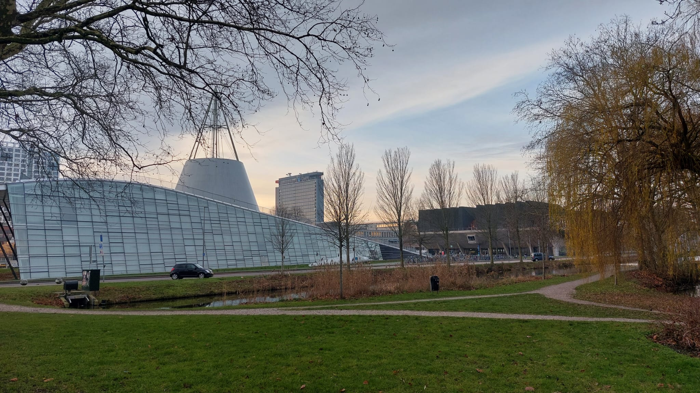

+++ { "kind": "split-image" }

## Template for TU Delft Jupyter Book 2 

a quick setup for your open publishing project.

{button}`Use this template <https://github.com/TUD-JB-Templates/JB2>`  

Originally created by  
*Freek Pols*

+++

